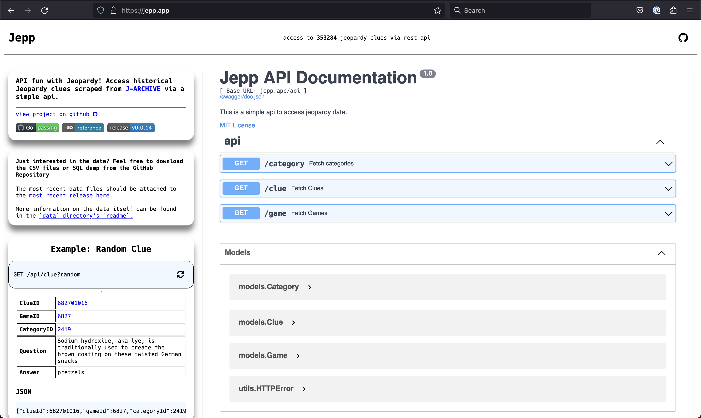
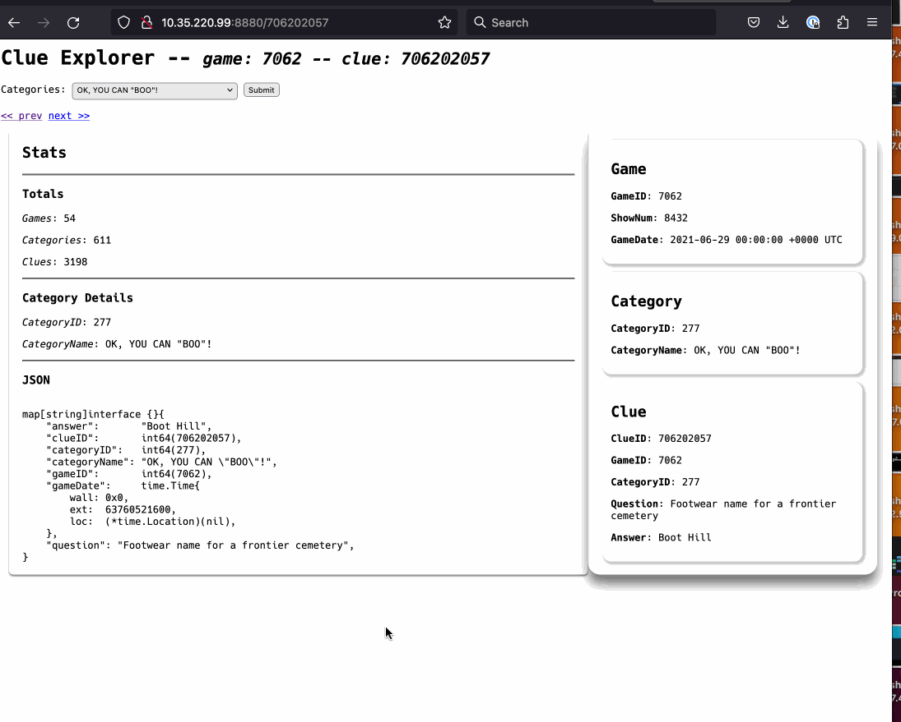

# [jepp api](https://jepp.app)

[](https://github.com/ecshreve/jepp/actions/workflows/go.yml)

[](https://goreportcard.com/report/github.com/ecshreve/jepp)
[](https://godoc.org/github.com/ecshreve/jepp)

---

api fun with jeopardy!



## api

- the api is a simple go web server built with [gin] that exposes a handful of endpoints to access the data
- the shape of the data returned from the api aligns with the db schema, this is accomplished via various struct tags on the type definitions
- for example, the `Clue` type is defined as follows:
```{golang}
type Clue struct {
	ClueID     int64  `db:"clue_id" json:"clueId" example:"804002032"`
	GameID     int64  `db:"game_id" json:"gameId" example:"8040"`
	CategoryID int64  `db:"category_id" json:"categoryId" example:"804092001"`
	Question   string `db:"question" json:"question" example:"This is the question."`
	Answer     string `db:"answer" json:"answer" example:"This is the answer."`
}
```
- the `db` struct tag is used by the [sqlx] library to map the db columns to the struct fields
- the `json` struct tag is used by the [gin] library to map the struct fields to the json response
- the `example` struct tag is used by the [swaggo] library to generate example responses for the swagger docs

### ui

- the ui is served from the `/` and `/ui` endpoints and is a simple html page that displays the swagger docs
  and some basic info
- the embedded swagger ui provides runnable request / response examples and type references

<hr>

## db

- getting the data into the database and cleaning it up after has been a manual process for the most part
- for local development i set the `DB_HOST`, `DB_USER`, `DB_PASS`, `DB_NAME` environment variables to target a `mariadb/mysql` server running in my home lab (also experimented with defining the db service and build params in a docker compose file)
- so personally i play with that local copy of the data, but for the public api i use a mysql db hosted on [digital ocean](https://www.digitalocean.com/products/managed-databases-mysql)
  - to populate this db i first created a backup of my local db and then restored it to the digital ocean db through an [adminer](https://hub.docker.com/_/adminer/) ui running in my home lab

## docs

- swagger docs generated with [swaggo] and embedded in the /ui
  page as part of the html template
- the `--parseVendor` was helpful here to generate the full `swagger.json` file that could be used
  in standalone mode by the ui

## scraping

- the `scrape` package contains the code to scrape [j-archive]
  and write the data to a mysql database
- [colly](https://github.com/gocolly/colly) is used to scrape the data

the scraping happened in a few passes to get all the data
- first pass was to get all the seasons and populate the seasons table
  - this scrape targeted the season [summary page on j-archive](https://www.j-archive.com/listseasons.php) and pulled the season number, start date, end date for each season
- second pass was to get all the games for each season and populate the game table
  - this scrape targets the individual [season show pages on j-archive](https://www.j-archive.com/showseason.php?season=1) and pulls the game number, air date, taped date for each season
- third pass was to get all the clues for each game in each season and populate the category and clue table
  - this scrape targets the individual [game pages on j-archive](https://www.j-archive.com/showgame.php?game_id=7040) and pulls the clue data from the tables on the page

## demo

- this is an example of a simple web app that uses a local copy of the database and a simple
  web ui to display the data




## references
[sqlx]: <https://github.com/jmoiron/sqlx>
[gin]: <https://github.com/gin-gonic/gin>
[swaggo]: <https://github.com/swaggo/swag>
[j-archive]: <https://www.j-archive.com/>
- [jservice](https://jservice.io/)
- [jservice repo](https://github.com/sottenad/jService)

---

<br>


---

<a href="https://www.buymeacoffee.com/ecshreve" target="_blank"></a>
