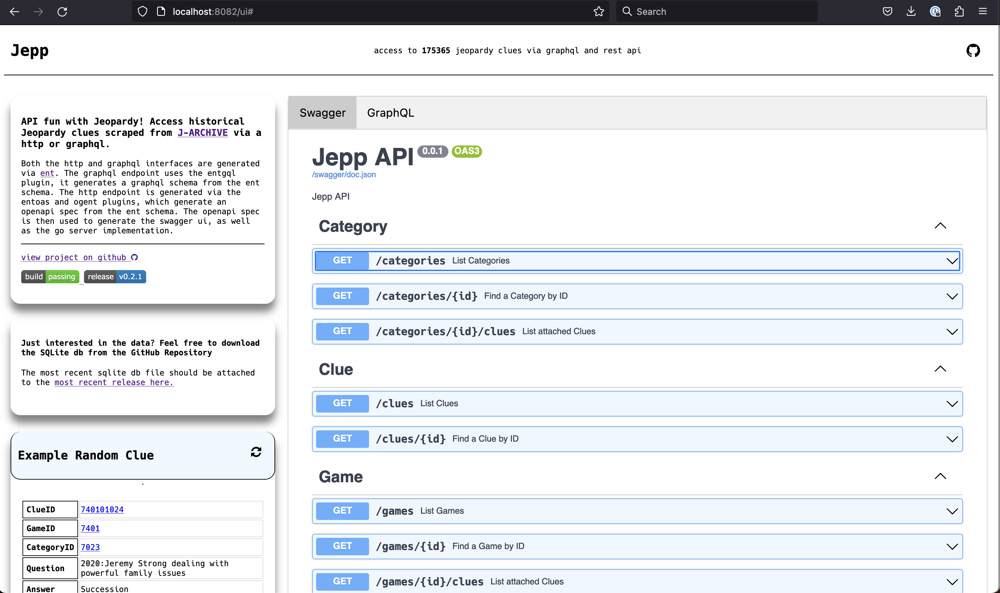
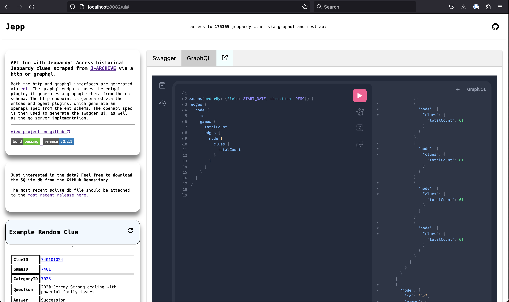

# [jepp](https://jepp.app)

API fun with Jeopardy! Access >100k Jeopardy clues scraped from [j-archive] via a simple api.

---

# API

The rest api is backed by a web server built with [gin] that exposes a few endpoints to access historical Jeopardy data. The schema and handlers are generated from the openapi
spec generated by [ent].

# GraphQL

The graphql api is backed by a web server built with [gqlgen] that exposes a query endpoint to access historical Jeopardy data. The schema and resolvers are generated from the ent schema via the [entgql] library.

## Types

Schemas is defined in [jepp/internal/ent], and the generated types are used throughout the app. The [ent] library is used to generate the database schema, and the [entc] library is used to generate the api schema and handlers. 

## Frontend / UI

- The ui is served from the `/ui` endpoint and is an html template that displays the swagger docs, graphiql query page, some
	general information, and a sample request.
- The embedded swagger ui provides runnable request / response examples and type references.

## Swagger Docs

- Swagger documentation is generated with [ent] and embedded in the homepage as part of the html template.

# DB

Currently the app uses a file based sqlite database. Below are some notes on the deprecated mysql setup.
All in all, the 15 seasons of data currently in the DB only end up as ~25 MB .sql file. Using
sqlite removed the need to run a mysql server and made the app easier to deploy and test.

## Notes on deprecated mysql setup

Getting the data into the database started as a manual process, and hasn't been automated yet because the data is all there and I haven't needed to import / export it recently.

Here's how I went about doing it initially:
- For local development I set the `DB_HOST`, `DB_USER`, `DB_PASS`, `DB_NAME` environment variables to target a `mariadb/mysql` server running in my home lab.
- Most of the time I play with that local copy of the data, but the public api uses a mysql db hosted on [digital ocean](https://www.digitalocean.com/products/managed-databases-mysql)
- Initially to populate the prod db I just manually created a backup of my local database and restored it to the prod database, both via an [adminer](https://hub.docker.com/_/adminer/) instance running in my home lab.
- Currently the `task sql:dump` command will create a dump of the database defined by the environment variables and write it to `data/dump.sql.gz`.
- Recent dumps of the prod database are available in the [data](data/) directory or as downloads on repository's [Releases](https://github.com/ecshreve/jepp/releases) page.

## Data Scraping (TODO: update this section)

note: all the scraping was done against the mysql database, not the current sqlite setup (though I did 
some brief testing and things seemed to still work for the most part _ymmv_)

The [scraper](pkg/scraper/) package contains the code to scrape [j-archive] for jeopardy clues and write the data to a mysql database. [Colly] is the package use to scrape the data and [sqlx] is used to write the data to the db. The scraping happened in a few passes, more or less following these steps:

Get all the seasons and populate the seasons table.

- This scrape targeted the season [summary page on j-archive](https://www.j-archive.com/listseasons.php) and pulled the season number, start date, end date for each season

Get all the games for each season and populate the game table.

- This scrape targets the individual [season show pages on j-archive](https://www.j-archive.com/showseason.php?season=1) and pulls the game number, air date, taped date for each season
 
Get all the clues for each game in each season and populate the category and clue tables

- This scrape targeted the individual [game pages on j-archive](https://www.j-archive.com/showgame.php?game_id=7040) and pulls the clue data from the `<table>` elements on the page

## references / prior art

- [jservice](https://jservice.io/)
- [jservice repo](https://github.com/sottenad/jService)
- [jeppy](https://github.com/ecshreve/jeppy)
- [illustrated sqlx](https://jmoiron.github.io/sqlx/)

[sqlx]: <https://github.com/jmoiron/sqlx>
[gin]: <https://github.com/gin-gonic/gin>
[swaggo]: <https://github.com/swaggo/swag>
[j-archive]: <https://www.j-archive.com/>
[colly]: <https://github.com/gocolly/colly>

